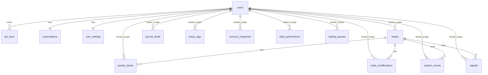

# Database Schema

Aegis uses PostgreSQL with Alembic migrations and SQLAlchemy ORM models.

## Migration Chain

Ordered revisions:

1. `001_baseline`
2. `002_users_api_keys`
3. `003_add_tenant_id`
4. `004_seed_user`
5. `005_tenant_not_null`
6. `006_sub_settings_rl`
7. `007_tradingview`

Operational notes:

- startup path verifies DB connectivity
- container entrypoint runs `alembic upgrade head`
- schema ownership is migration-first, not runtime auto-create

## ERD (Mermaid)

## Table Inventory (16)

### Identity and Subscription

1. `users`
2. `api_keys`
3. `subscriptions`
4. `user_settings`
5. `rate_limits`

### Trading and Journal

6. `trades`
7. `partial_closes`
8. `trade_modifications`
9. `journal_deals`
10. `setup_tags`

### Performance and Controls

11. `account_snapshots`
12. `daily_performance`
13. `signals`
14. `system_events`
15. `trading_pauses`

### Market Data

16. `price_bars`

## Column-Level Reference

## users

- `id` UUID PK
- `email` unique indexed
- `username` unique indexed
- `hashed_password`
- `is_active`, `is_admin`
- `created_at`, `updated_at`

## api_keys

- `id` UUID PK
- `user_id` FK -> users.id
- `key_hash` unique
- `key_prefix`, `name`
- `is_active`
- `last_used_at`, `created_at`, `expires_at`

## subscriptions

- `id` UUID PK
- `user_id` unique FK -> users.id
- `tier` enum-like constraint (`journal|pro|autopilot`)
- Stripe fields
- `status` constraint (`trialing|active|past_due|canceled|paused`)
- period dates and audit timestamps

## user_settings

- `id` UUID PK
- `user_id` unique FK -> users.id
- MT5 settings (`mt5_login`, `mt5_server`, `mt5_password_enc`, `mt5_mode`)
- risk controls (`max_daily_drawdown_pct`, `max_consecutive_losses`, `max_lot_size`, `max_open_positions`, `max_daily_trades`)
- session/symbol allowlists
- strategy fields (`active_strategy_id`, `strategy_params` JSONB)
- notification fields (`telegram_*`, notification toggles)
- `preferences` JSONB
- audit timestamps

## rate_limits

- `tier` PK
- `api_requests_per_minute`
- `api_requests_per_day`
- `webhook_events_per_minute`
- `max_backtests_per_day`
- `max_strategies`
- `max_connected_accounts`

## trades

Core lifecycle table.

Key columns:

- identity: `id`, `tenant_id`, `ticket`
- instrument/order: `symbol`, `order_type`, `status`
- strategy metadata: `signal_source`, `strategy_name`, `signal_time`
- pricing: `entry_price`, `requested_entry_price`, `exit_price`
- sizing: `lot_size`, `initial_lot_size`
- risk levels: `stop_loss`, `take_profit_1`, `take_profit_2`, `take_profit_final`, `trailing_stop`
- state: `position_state`
- results: `profit_loss`, `profit_loss_pips`, `profit_loss_percent`, `outcome`, `risk_reward_*`
- context JSONB: `market_context`, `strategy_data`
- journal fields: `setup_tag`, `journal_notes`, `trading_session`, `hour_of_day`, `day_of_week`
- source tracking: `mt5_position_id`, `trade_source`
- audit: `created_at`, `updated_at`, manual intervention flags

Important indexes/constraints include:

- unique `(ticket, tenant_id)`
- strategy/time, session, setup-tag indexes
- JSONB GIN index on `market_context` from migration 007

## partial_closes

- `id` UUID PK
- `tenant_id` FK
- `trade_id` FK -> trades.id
- `close_time`, `close_price`, `lots_closed`, `profit_loss`, `reason`
- `created_at`

## trade_modifications

- `id` UUID PK
- `tenant_id` FK
- `trade_id` FK -> trades.id
- `modification_time`
- `field_modified`, `old_value`, `new_value`
- `reason`, `was_automatic`
- `created_at`

## journal_deals

Raw MT5 audit log table:

- identifiers: `deal_id`, `position_id`, `order_id`
- deal details: `symbol`, `deal_time`, `deal_type`, `entry_type`, `volume`, `price`
- financials: `commission`, `swap`, `profit`
- classification: `exit_reason`, `comment`, `raw_reason_code`
- `tenant_id`, `created_at`

Constraint:

- unique `(deal_id, tenant_id)`

## setup_tags

- `id` integer PK
- `tenant_id` FK
- `name`, `color`, `description`
- `created_at`

Constraint:

- unique `(name, tenant_id)`

## account_snapshots

Time-series account state:

- `timestamp`
- balance/equity/margin/free margin/margin level
- floating PnL
- position counts
- daily metrics
- drawdown fields
- `tenant_id`, `created_at`

## daily_performance

Daily aggregates:

- `date`
- counts (total/win/loss/breakeven)
- gross/net PnL fields
- start/end balance
- quality metrics (`win_rate`, `profit_factor`, average and extremes)
- drawdown metrics
- `strategy_breakdown` JSONB
- `tenant_id`, timestamps

Constraint:

- unique `(date, tenant_id)`

## signals

Signal records regardless of execution:

- `timestamp`, `symbol`, `strategy_name`, `signal_source`
- `direction`, `strength`
- proposed order params
- execution flags and rejection reason
- optional `trade_id` FK
- `market_context` JSONB
- `tenant_id`, `created_at`

## system_events

- `timestamp`, `event_type`, `severity`
- `message`, `details` JSONB
- optional `trade_id` FK
- `tenant_id`, `created_at`

## trading_pauses

- `start_time`, `end_time`
- `reason`
- `trigger_value`, `threshold_value`
- `was_automatic`, `notes`
- `tenant_id`, `created_at`

## price_bars

Market data bars:

- `symbol`, `timeframe`, `timestamp`
- OHLC and volume fields
- optional tick/spread

Constraint:

- unique `(symbol, timeframe, timestamp)`

## Tenant Isolation Rules

Tenant-scoped tables enforce `tenant_id` semantics. Migration `005_tenant_not_null` enforces non-null tenant IDs on scoped tables.

Non-tenant reference/identity tables:

- `users`
- `api_keys` (owned by user_id)
- `subscriptions` (one row per user)
- `user_settings` (one row per user)
- `rate_limits` (reference rows)
- `price_bars` (shared market data)

## JSONB Fields and Usage

Primary JSONB fields:

- `trades.market_context`
- `trades.strategy_data`
- `user_settings.strategy_params`
- `user_settings.preferences`
- `daily_performance.strategy_breakdown`
- `signals.market_context`
- `system_events.details`

These allow strategy and integration metadata evolution without frequent schema migrations.

## Repository Pattern Catalog

Source: `src/database/repository.py`

### TradeRepository

- `create`
- `get_by_id`
- `get_by_ticket`
- `get_open_trades`
- `get_recent_trades`
- `get_trades_in_range`
- `get_today_trades`
- `count_today_trades`
- `get_consecutive_losses`
- `update`
- `add_partial_close`
- `add_modification`

### PerformanceRepository

- `save_snapshot`
- `get_latest_snapshot`
- `get_peak_equity`
- `get_daily_performance`
- `save_daily_performance`
- `get_performance_range`
- `calculate_current_drawdown`

### SignalRepository

- `save`
- `get_recent_signals`
- `get_signal_execution_rate`

### SystemRepository

- `log_event`
- `start_trading_pause`
- `end_trading_pause`
- `get_active_pause`
- `get_recent_events`

## Migration and Runtime Verification Checklist

1. `alembic history` matches expected chain 001-007.
2. `alembic current` at head in deployed environment.
3. tenant-scoped tables enforce non-null tenant IDs.
4. tier limits match seeded `rate_limits` rows.
5. `trades.market_context` index exists for JSONB query performance.

## Source Citations

- [src/database/models.py](../src/database/models.py#L82)
- [src/database/models.py](../src/database/models.py#L203)
- [src/database/models.py](../src/database/models.py#L256)
- [src/database/models.py](../src/database/models.py#L500)
- [src/auth/models.py](../src/auth/models.py#L17)
- [src/auth/subscription_models.py](../src/auth/subscription_models.py#L31)
- [src/database/repository.py](../src/database/repository.py#L129)
- [alembic/versions/001_baseline.py](../alembic/versions/001_baseline.py#L14)
- [alembic/versions/006_subscriptions_settings_ratelimits.py](../alembic/versions/006_subscriptions_settings_ratelimits.py#L17)
- [alembic/versions/007_tradingview_support.py](../alembic/versions/007_tradingview_support.py#L16)

## Related Docs

- `docs/API_REFERENCE.md`
- `docs/PRD.md`
- `docs/ARCHITECTURE.md`
- `alembic/versions/`
- `src/database/models.py`
- `src/database/repository.py`
